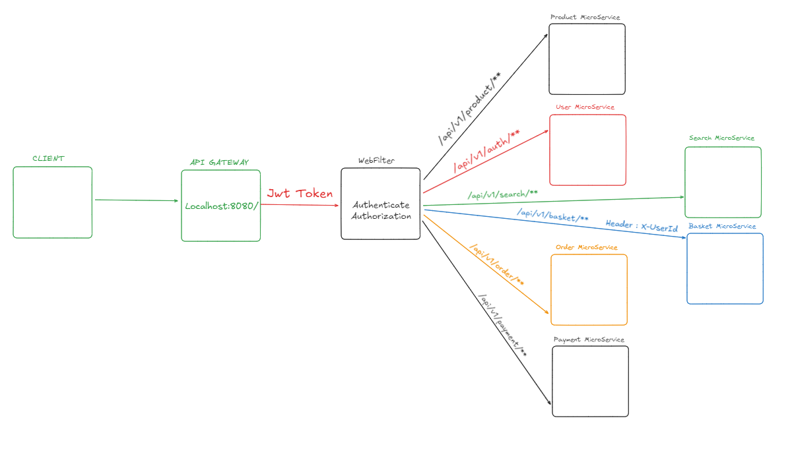
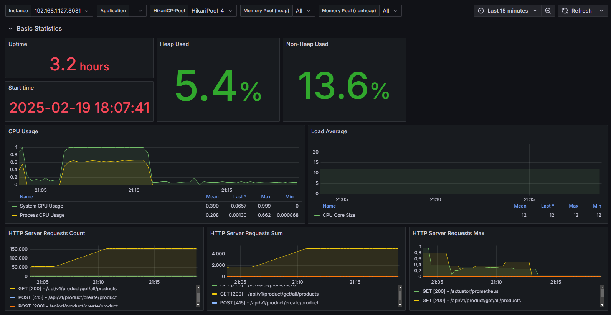
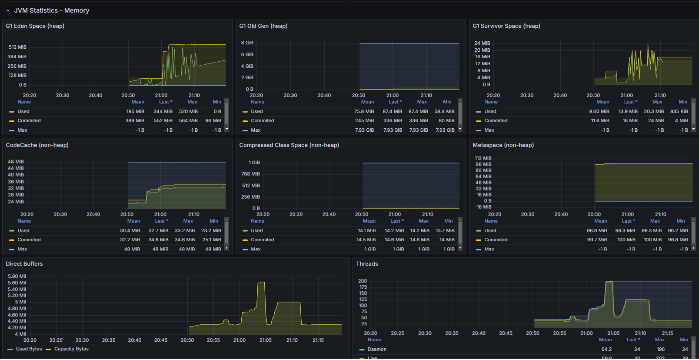
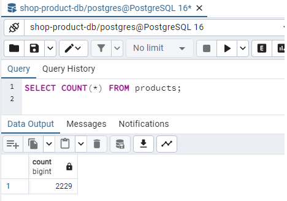
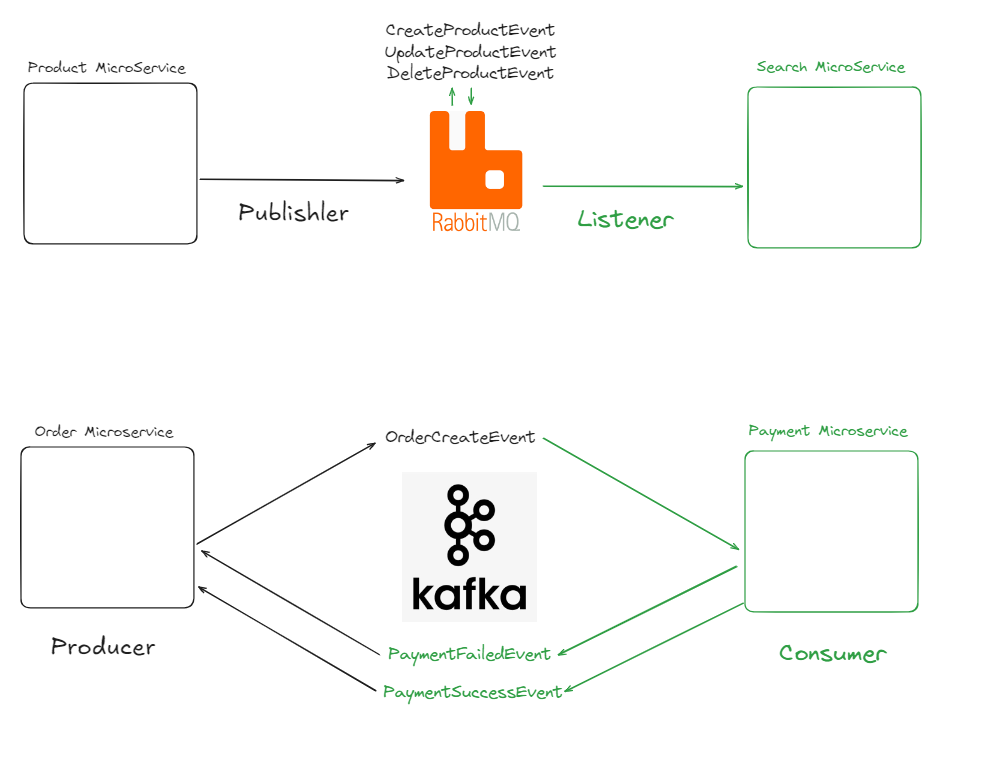
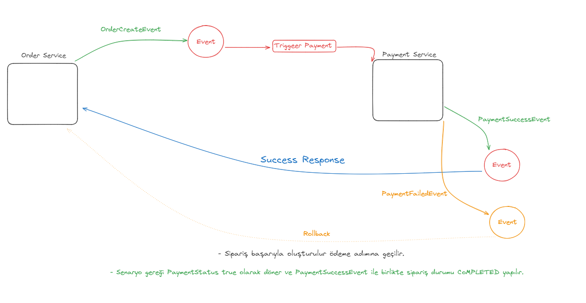

# E-Ticaret Sitesi - Microservice Mimari

🚀 **Proje Hakkında** 🚀

Projenin ana odak noktası **Gateway ile Auth işlemleri** ve **Saga Pattern** kullanımıdır. Merkezi **auth** işlemleri için **Keycloak**, **AbstractGatewayFilter** ve **WebFilter** ile alakalı dökümantasyonlar ve projeler araştırılmıştır. Bu dökümantasyonlar doğrultusunda, yetkilendirme işlemi için **WebFilter** seçilmiştir. Gelişimimi ve hata payını en aza indirmek amacıyla geri dönüşleriniz benim için çok önemli.

Bu proje, **microservice mimarisi** kullanarak geliştirilmiş bir **e-ticaret sitesi** uygulamasıdır. Projede **Gateway Server** ile merkezi **auth** işlemleri yapılmış ve **Saga Pattern** kullanılarak **transactional işlemler** gerçekleştirilmiştir. Proje, modern yazılım geliştirme prensiplerine dayalı olarak **Java 17**, **Spring Boot**, ve **Spring Cloud** gibi güçlü teknolojiler ile geliştirilmiştir. Ayrıca, **Spring Security** ile güvenlik sağlanmış ve **Kafka**, **RabbitMQ** gibi mesajlaşma sistemleriyle mikroservisler arasında iletişim kurulmuştur.

---

### Temel Özellikler:

- **Microservice Mimarisi**: Uygulama, her bir işlevi farklı mikroservislerle bağımsız bir şekilde gerçekleştiren bir yapıya sahiptir.
- **Gateway Server**: API Gateway kullanılarak tüm servislerin merkezi bir noktadan yönetilmesi sağlanmıştır.
- **Merkezi Kimlik Doğrulama ve Yetkilendirme**: WebFilter kullanılarak kimlik doğrulama ve yetkilendirme işlemleri gerçekleştirilmiştir. Kullanıcı doğrulaması ve yetkilendirme süreçleri **Spring Security** ile yönetilmektedir.
- **Saga Pattern**: İşlemler arasında tutarlılığı sağlamak için **Saga Pattern** kullanılarak birden fazla servisle yapılan işlemler bütünlüğü korunmuştur.
- **Mesajlaşma Sistemleri**: **Kafka** ve **RabbitMQ** kullanılarak servisler arası asenkron iletişim sağlanmıştır.
- **Elasticsearch**: Ürün arama ve filtreleme işlevselliği için **Elasticsearch** entegrasyonu sağlanmıştır.
- **Docker**: Uygulamanın tüm servisleri Docker container'larında çalıştırılarak geliştirme ortamından bağımsız bir yapıya kavuşturulmuştur.
- **Grafana & Prometheus**: Uygulama izleme ve performans takibi için **Grafana** ve **Prometheus** kullanılmıştır.

---

### 🚀 Kullanılan Teknolojiler:

- **Java 17**
- **Spring Boot**
- **Spring Cloud**
- **Spring Security**
- **Kafka**
- **RabbitMQ**
- **Elasticsearch**
- **Docker**
- **Grafana**
- **Prometheus**
- **Microservice Mimarisi**
- **Saga Pattern**

---

### ⚙️ Merkezi Kimlik Doğrulama ve Yetkilendirme:

Projemde **merkezi kimlik doğrulama ve yetkilendirme** işlemi için **WebFilter** kullanılmıştır. Her gelen HTTP isteği, bu filtre ile kontrol edilerek kimlik doğrulama ve yetkilendirme süreçleri gerçekleştirilmiştir. Tüm güvenlik işlemleri **Spring Security** ile yönetilmektedir.

### Proje Görselleri
### 📊 Gateway
- 
### 📊 Grafana Görselleştirmesi
- 
- 
### 📊 Veritabanı Veri Sayısı
- 
### 📊 Kafka ve RabbitMQ 
- 
### 📊 SagaPatern 
- 

